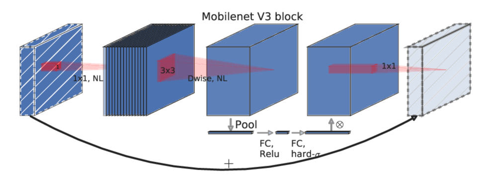

# MobileNetV3 PyTorch Implementation

The fast and efficient `MobileNetV3` implemented from scratch in PyTorch.

It's the `MobileNetV2` with the addition of `Squeeze-and-Excite` in the residual layer.

## MobileNetV3 main block structure:

## MobileNetV2 main block structure:

The link to the original article can be found [here](https://arxiv.org/abs/1905.02244v5).